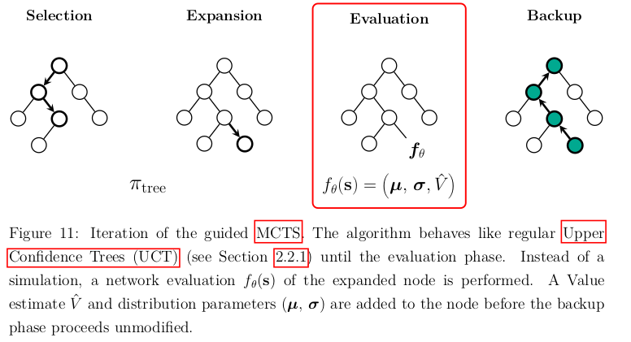
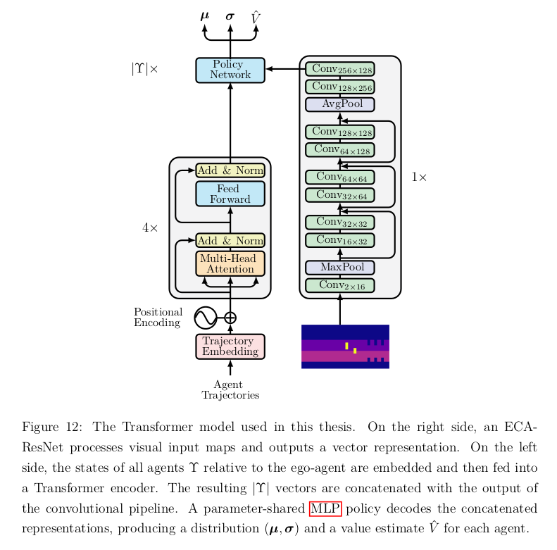
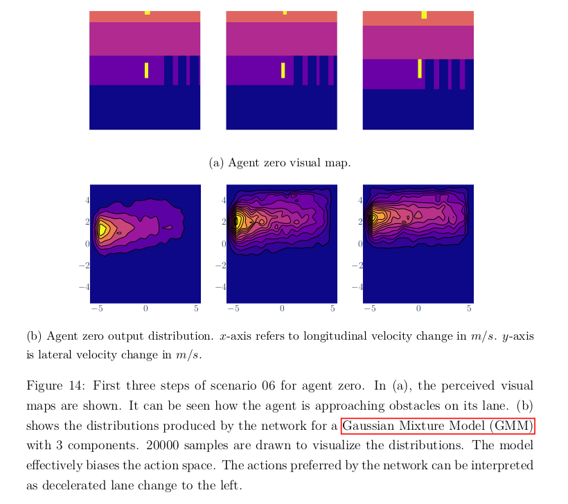
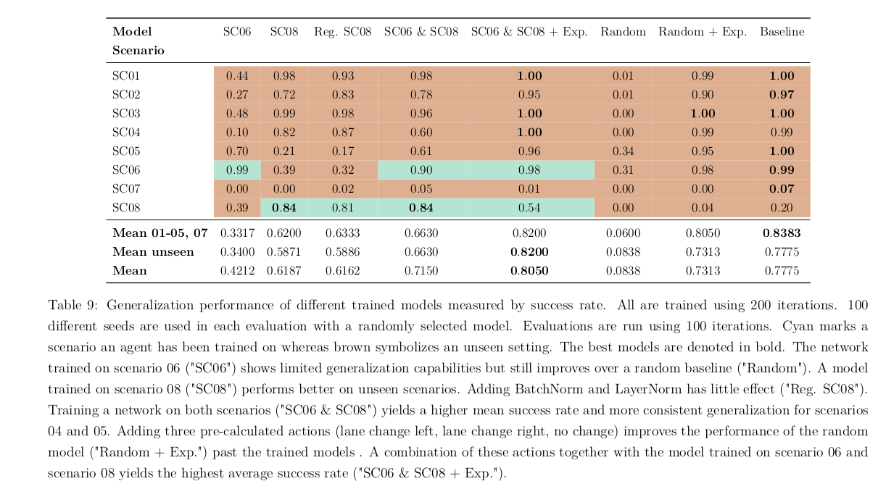

# Combining Reinforcement Learning and Search for CooperativeTrajectory Planning
This repository contains the LaTeX code together with all plots and files to generate my thesis pdf.

## Notes
- Plots were created using seaborn and plotly. The `.pdf_tex` files can then be generated using [inkscape](https://inkscape.org/).
- The project was written and compiled with [Overleaf](https://www.overleaf.com/).
- The thesis uses the aifb thesis template which can be found [here](https://www.aifb.kit.edu/web/Abschlussarbeiten/en)

## Where is the code?
The project into which my thesis is embedded is unfortunately not open sourced yet. This is however planned. Once the project is on GitHub I will provide a link to it in this section.

## Examples
Below are some example plots.

### Guided Monte Carlo tree search

### Network architecture

### Pruned sample space examples

### Generalization results
